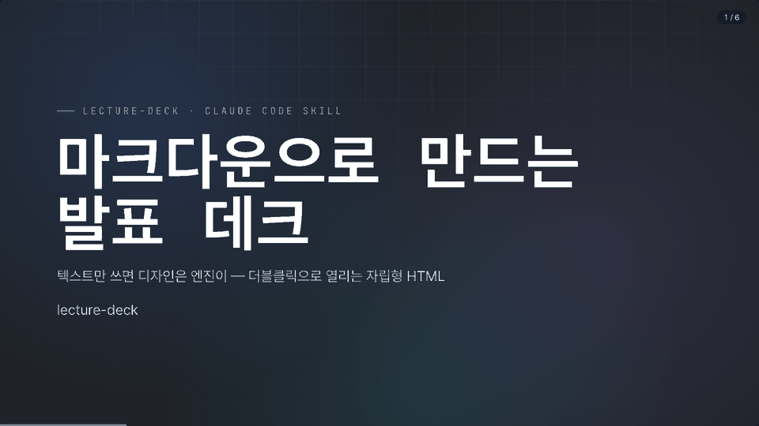
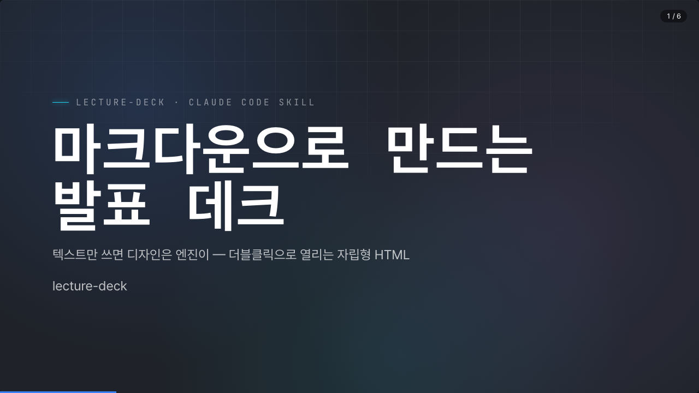
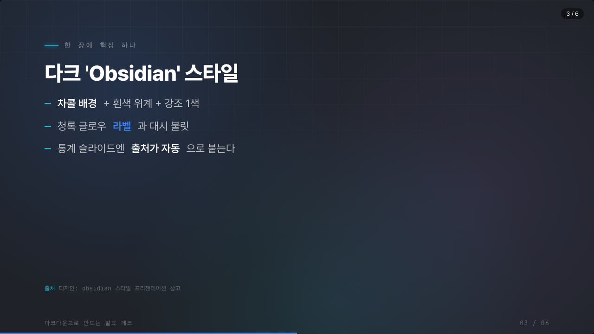
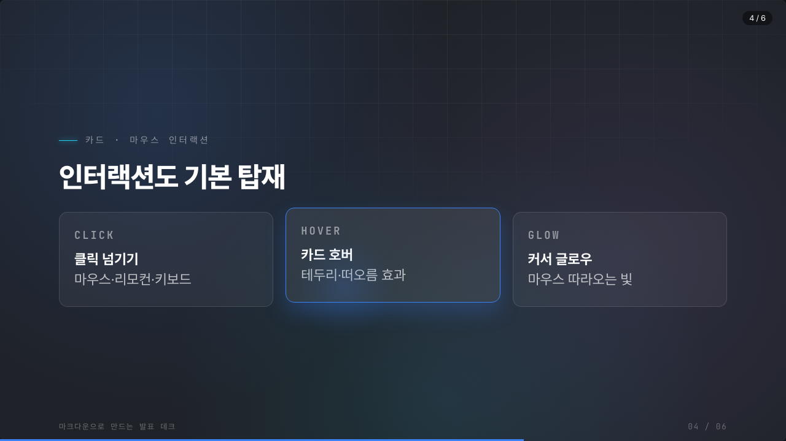

# lecture-deck — HTML 강의안 제작 Claude Code 스킬

마크다운 한 파일로 **다크 'Obsidian' 스타일 HTML 강의안(슬라이드 데크)** 을 만드는 Claude Code 플러그인입니다.
PPTX 대신 텍스트로 작성하고, Claude에게 말로 시켜 발표용 `deck.html`·PDF·강사 노트까지 한 세트로 뽑습니다.

> "이 개요로 강의안 만들어줘" 한마디면, Claude가 슬라이드를 작성하고 더블클릭으로 열리는 발표 파일까지 빌드합니다.

---

## 🎬 데모



| 표지 | 콘텐츠 + 출처 표기 | 카드 호버·커서 글로우 |
|:---:|:---:|:---:|
|  |  |  |

---

## ✨ 특징

- **마크다운 → 발표 데크** — `slides.md` 한 파일이 원본. 디자인은 엔진이 입힘.
- **자립형 `deck.html`** — 더블클릭하면 서버·인터넷 없이 바로 열림(모든 내용 내장).
- **다크 Obsidian 스타일** — 차콜 배경 + 흰색 위계 + 강조 1색(3색 원칙), Pretendard·JetBrains Mono, 청록 글로우 라벨.
- **통계엔 출처 필수** — `@src` 로 슬라이드 하단에 출처 표기(없으면 '원본 확인 필요', 날조 금지).
- **강사 노트** — 슬라이드별 배경·멘트·예상질문·진행팁을 `???` 발표자 노트(S키)로.
- **산출물 한 세트** — 발표 `deck.html` · 16:9 인쇄 PDF · 읽기용 줄글 문서 · 강사 노트.
- **발표 인터랙션** — 마우스 클릭/우클릭·리모컨(PageUp/Down) 넘기기, 카드 호버 효과, 마우스 따라오는 글로우. 한/영 무관 단축키.
- **이미지 자리** — `@img` 점선 박스로 표시, 실제 사진은 사용자가 삽입.

## 🧩 포함된 것

| 구성 | 설명 |
|---|---|
| `skills/lecture-deck/SKILL.md` | Claude가 따르는 제작 프로세스·스타일 규칙 |
| `skills/lecture-deck/MANUAL.md` | 사용자용 매뉴얼 |
| `skills/lecture-deck/template/` | 깨끗한 툴킷(엔진·빌드 스크립트·샘플) |

## 📦 설치

### A. 플러그인 마켓플레이스로 설치 (권장)

Claude Code에서:

```
/plugin marketplace add Artisit-Insist/lecture-deck-plugin
/plugin install lecture-deck@lecture-deck-marketplace
```

### B. 스킬만 직접 복사

```bash
git clone https://github.com/Artisit-Insist/lecture-deck-plugin.git
cp -R lecture-deck-plugin/skills/lecture-deck ~/.claude/skills/lecture-deck
```

## 🚀 사용

설치 후 Claude Code에서 자연어로:

- "이 개요로 강의안 만들어줘" (+ 주제·목차·시간·대상)
- "강사 노트도 만들어서 발표자 노트로 넣어줘"
- "PDF로 뽑아줘" / "읽기용 문서도 줘"
- "표지 강조색을 그린으로 바꿔줘"

발표는 `deck.html` 더블클릭. 단축키: 클릭/`←→` 넘기기 · `F` 전체화면 · `S` 노트 · `O` 한눈에 · `P` 인쇄 · `?` 도움말.

자세한 제작 프로세스는 [`skills/lecture-deck/template/PROCESS.md`](skills/lecture-deck/template/PROCESS.md), 사용 매뉴얼은 [`skills/lecture-deck/MANUAL.md`](skills/lecture-deck/MANUAL.md) 참고.

## 🛠 요구사항

- macOS/Linux/Windows (Python 3 — 빌드·PDF 스크립트용)
- 발표 자체는 브라우저만 있으면 됨(의존성 0, 오프라인 가능)
- PDF 자동 내보내기는 Chrome/Edge/Brave 중 하나

## 📄 라이선스

[MIT](LICENSE)
